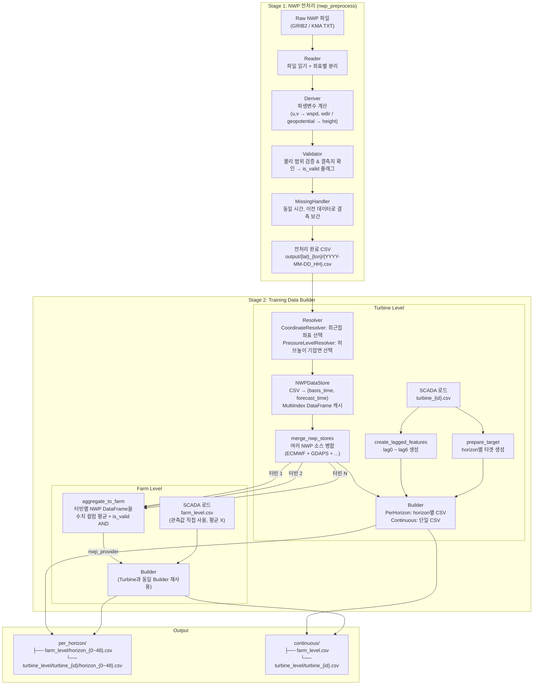

```mermaid
graph TD
    subgraph "Stage 1: NWP 전처리 (nwp_preprocess)"
        RAW["Raw NWP 파일<br/>(GRIB2 / KMA TXT)"]
        READ["Reader<br/>파일 읽기 + 좌표별 분리"]
        DERIVE["Deriver<br/>파생변수 계산<br/>(u,v → wspd, wdir / geopotential → height)"]
        VALIDATE["Validator<br/>물리 범위 검증 & 결측치 확인 → is_valid 플래그"]
        FILL["MissingHandler<br/>동일 시간, 이전 데이터로 결측 보간"]
        CSV_OUT["전처리 완료 CSV<br/>output/{lat}_{lon}/{YYYY-MM-DD_HH}.csv"]

        RAW --> READ --> DERIVE --> VALIDATE --> FILL --> CSV_OUT
    end

    subgraph "Stage 2: Training Data Builder"

        subgraph "Turbine Level"
            T_SCADA["SCADA 로드<br/>turbine_{id}.csv"]
            T_RESOLVE["Resolver<br/>CoordinateResolver: 최근접 좌표 선택<br/>PressureLevelResolver: 허브높이 기압면 선택"]
            T_STORE["NWPDataStore<br/>CSV → (basis_time, forecast_time)<br/>MultiIndex DataFrame 캐시"]
            T_MERGE["merge_nwp_stores<br/>여러 NWP 소스 병합<br/>(ECMWF + GDAPS + ...)"]
            T_LAG["create_lagged_features<br/>lag0 ~ lag6 생성"]
            T_TARGET["prepare_target<br/>horizon별 타겟 생성"]
            T_BUILD["Builder<br/>PerHorizon: horizon별 CSV<br/>Continuous: 단일 CSV"]

            CSV_OUT --> T_RESOLVE --> T_STORE --> T_MERGE
            T_SCADA --> T_LAG
            T_SCADA --> T_TARGET
            T_MERGE --> T_BUILD
            T_LAG --> T_BUILD
            T_TARGET --> T_BUILD
        end

        subgraph "Farm Level"
            F_SCADA["SCADA 로드<br/>farm_level.csv<br/>(관측값 직접 사용, 평균 X)"]
            F_AGG["aggregate_to_farm<br/>터빈별 NWP DataFrame을<br/>수치 컬럼 평균 + is_valid AND"]
            F_BUILD["Builder<br/>(Turbine과 동일 Builder 재사용)"]

            T_MERGE -- "터빈 1" --> F_AGG
            T_MERGE -- "터빈 2" --> F_AGG
            T_MERGE -- "터빈 N" --> F_AGG
            F_AGG -- "nwp_provider" --> F_BUILD
            F_SCADA --> F_BUILD
        end
    end

    subgraph "Output"
        OUT_PH["per_horizon/<br/>├── farm_level/horizon_{0~48}.csv<br/>└── turbine_level/turbine_{id}/horizon_{0~48}.csv"]
        OUT_CT["continuous/<br/>├── farm_level.csv<br/>└── turbine_level/turbine_{id}.csv"]

        T_BUILD --> OUT_PH
        T_BUILD --> OUT_CT
        F_BUILD --> OUT_PH
        F_BUILD --> OUT_CT
    end
```